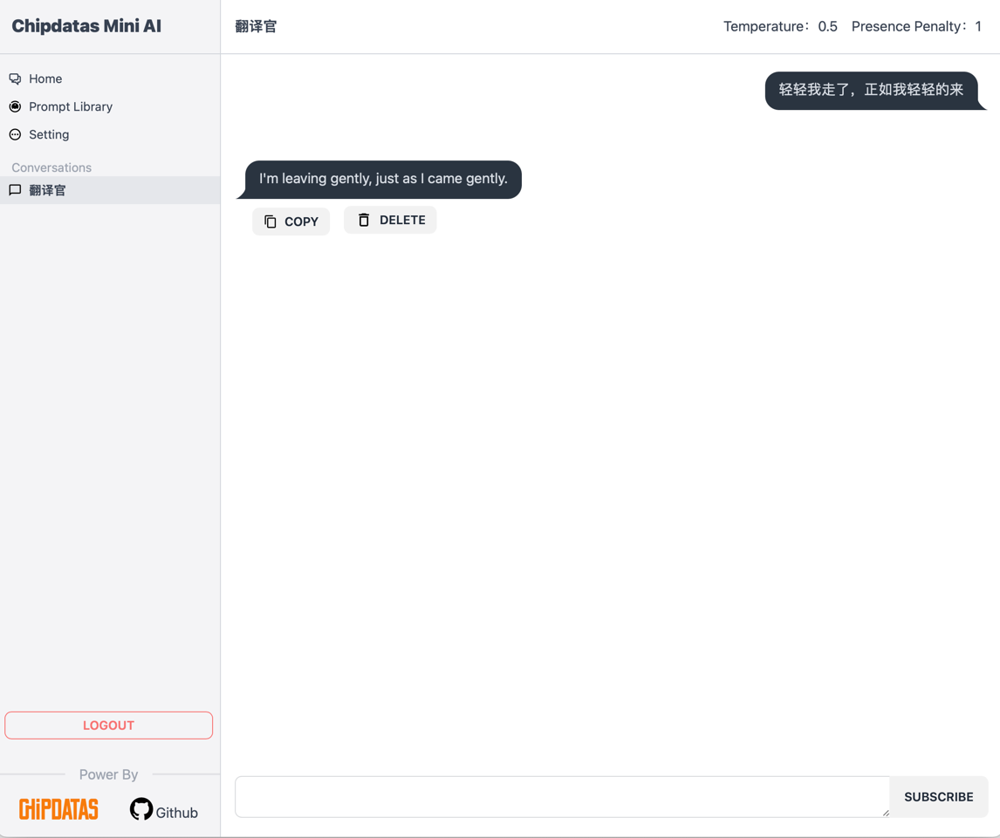
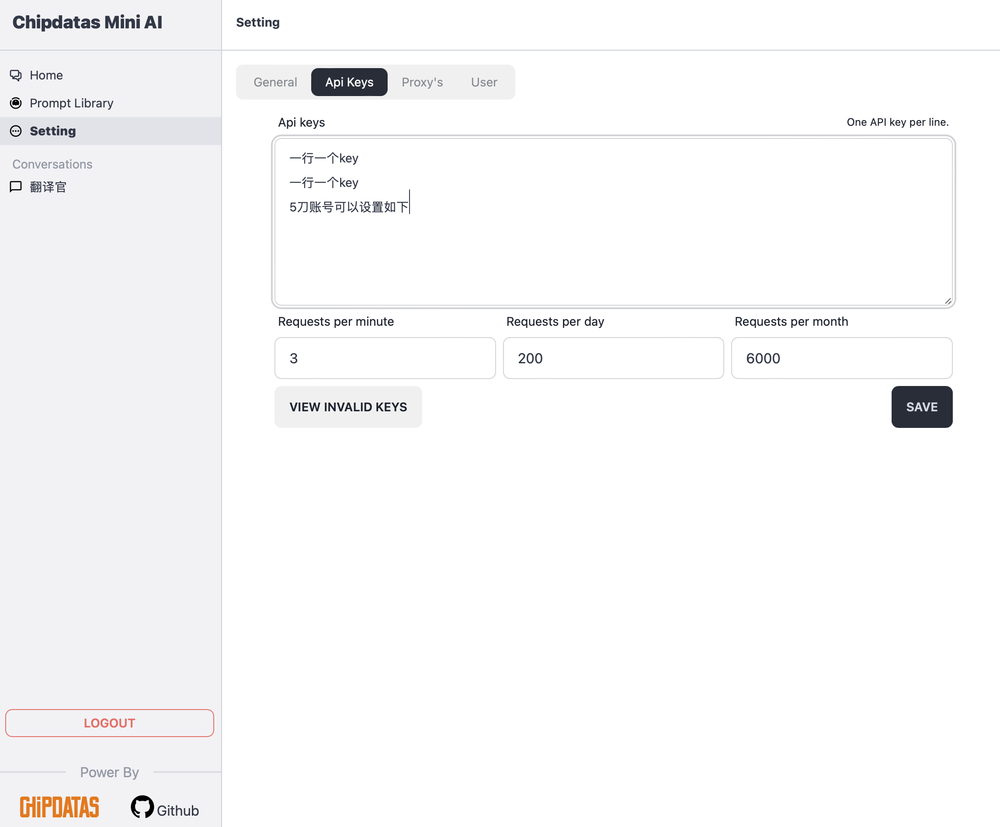

# 新openai对话工具

**当前版本： v0.1.0**

####  使用这个小工具的朋友，恳请在自己网站（如果有的话）上加个友情链接，这是我更新的动力和目的，有你支持，将更新更多功能上去
> 友情链接信息： Chipdatas  - https://www.chipdatas.com


## 亮点
1. 支持多代理，流量控制
2. 支持多账号，设置流量控制，如每分钟3个，每天200个。（5元号大用途来了）
3. 支持多个对话，多个对话可以同时进行，互不影响。
4. 支持多用户，团队使用。


### 路线图
- [ ] 团队token兑换功能
- [ ] 工作流功能
- [ ] 快捷输入
- [ ] 对话的各种修改
- [ ] 接入pdf
- [ ] 接入图片？


### 截图






## 用法

### docker

**推荐使用以下命令：**

- 运行命令(端口和文件目录)[用户home目录下]【后台运行】：
```
docker run -it -d -p 7777:7777 -v ~/miniai/chat:/code/app/chat  -v ~/miniai/preset_mask:/code/app/preset_mask   -v ~/miniai/config:/code/app/config     chipdatas/miniai:latest
```


一旦运行完成，则打开浏览器:
```
http://你的域名或者IP:7777
```

> 默认账号密码：admin/admin


如果需要使用nginx反向代理，可以参考以下配置：
```
server {
    listen 80;
    server_name 你的域名或者IP;
    location / {
        proxy_pass http://你的域名或者IP:7777;
    }
}
```


### 本地
等前端放出后再出。


### 开源

确定开源，但是不确定完全放开时间，有些地方还不够完善，需要整理一下。

#### 后端代码获取
访问docker内部，/code目录下即是python源码。

#### 前端代码获取
等进一步叠加功能，整理后将在本地开放。


### 本地运行
尚未完全放出所有源码，所以如果有需要本地运行的， 请取docker镜像下的源码，自行运行。


### 约定
使用这个小工具的朋友，恳请在自己网站（如果有的话）上加个友情链接，这是我更新的动力和目的，有你支持，将更新更多功能上去
友情链接信息： Chipdatas  - https://www.chipdatas.com
 
